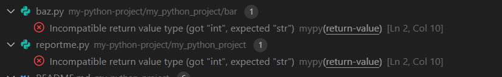

# `mypy-vscode` [#89](https://github.com/matangover/mypy-vscode/issues/89) repro

Installation: `poetry install`, then open the repository in VS Code.

## Expected

When opening the VS Code repository from the root, the Mypy extension should display the same errors as running `mypy`:

```sh
$ poetry run mypy .
my_python_project/reportme.py:2: error: Incompatible return value type (got "int", expected "str")  [return-value]
Found 1 error in 1 file (checked 3 source files)
```

## Actual

The mypy extension shows two problems:



It _does_ correctly take the `mypy.ini` file into account as the error in `example.py` did disappear.

As I understand it, the main issue is that the `exclude` rules don't work as they're probably being interpreted relative to the root of the opened workspace, not the Python project's root.
